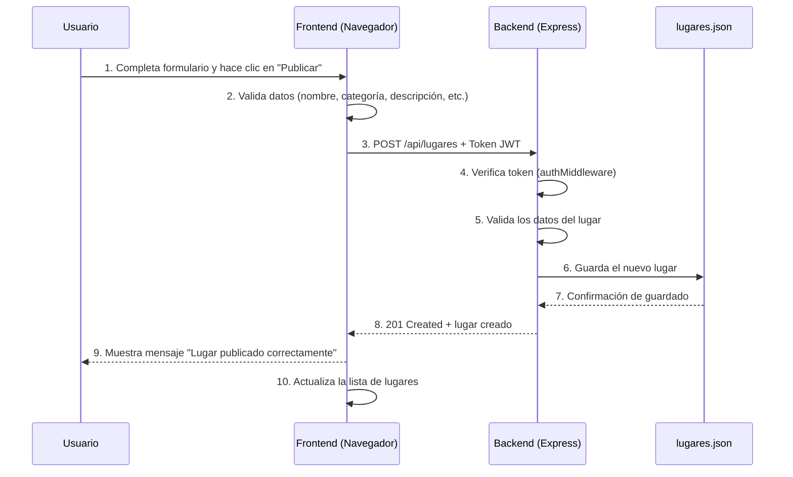
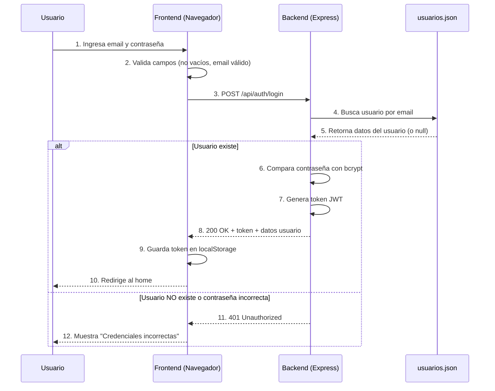

## D06 - Diagrama de Secuencia 1: Publicar un lugar

```mermaid
sequenceDiagram
    participant Usuario
    participant Frontend as Frontend (Navegador)
    participant Backend as Backend (Express)
    participant JSON as lugares.json

    Usuario->>Frontend: 1. Completa formulario y hace clic en "Publicar"
    Frontend->>Frontend: 2. Valida datos (nombre, categoría, descripción, etc.)
    Frontend->>Backend: 3. POST /api/lugares + Token JWT
    Backend->>Backend: 4. Verifica token (authMiddleware)
    Backend->>Backend: 5. Valida los datos del lugar
    Backend->>JSON: 6. Guarda el nuevo lugar
    JSON-->>Backend: 7. Confirmación de guardado
    Backend-->>Frontend: 8. 201 Created + lugar creado
    Frontend-->>Usuario: 9. Muestra mensaje "Lugar publicado correctamente"
    Frontend->>Frontend: 10. Actualiza la lista de lugares
```

## D06 - Diagrama de Secuencia 2: Iniciar sesión

```mermaid
sequenceDiagram
    participant Usuario
    participant Frontend as Frontend (Navegador)
    participant Backend as Backend (Express)
    participant JSON as usuarios.json

    Usuario->>Frontend: 1. Ingresa email y contraseña
    Frontend->>Frontend: 2. Valida campos (no vacíos, email válido)
    Frontend->>Backend: 3. POST /api/auth/login
    Backend->>JSON: 4. Busca usuario por email
    JSON-->>Backend: 5. Retorna datos del usuario (o null)
    
    alt Usuario existe
        Backend->>Backend: 6. Compara contraseña con bcrypt
        Backend->>Backend: 7. Genera token JWT
        Backend-->>Frontend: 8. 200 OK + token + datos usuario
        Frontend->>Frontend: 9. Guarda token en localStorage
        Frontend-->>Usuario: 10. Redirige al home
    else Usuario NO existe o contraseña incorrecta
        Backend-->>Frontend: 11. 401 Unauthorized
        Frontend-->>Usuario: 12. Muestra "Credenciales incorrectas"
    end
```
