# D01 — Diagrama de casos de uso
## Descubre Medellín

Muestra los actores del sistema y las funcionalidades principales desde la perspectiva del usuario.

```mermaid
graph TD
  subgraph Sistema["🖥️ Descubre Medellín"]

    subgraph Publico["Acceso público"]
      UC1["Ver listado de lugares"]
      UC2["Ver detalle de lugar"]
      UC3["Buscar lugares"]
      UC4["Filtrar por categoría y precio"]
    end

    subgraph NoAuth["Solo usuarios no autenticados"]
      UC5["Registrarse"]
      UC6["Iniciar sesión"]
    end

    subgraph Auth["Requiere autenticación"]
      UC7["Publicar nuevo lugar"]
      UC8["Comentar en un lugar"]
      UC9["Calificar un lugar"]
      UC10["Agregar a favoritos"]
      UC11["Ver lista de favoritos"]
      UC12["Cerrar sesión"]
    end

  end

  Visitante(["👤 Usuario visitante"])
  Registrado(["👤 Usuario registrado"])
  Backend(["⚙️ Sistema backend"])

  Visitante --> UC1
  Visitante --> UC2
  Visitante --> UC3
  Visitante --> UC4
  Visitante --> UC5
  Visitante --> UC6

  Registrado --> UC1
  Registrado --> UC2
  Registrado --> UC3
  Registrado --> UC4
  Registrado --> UC7
  Registrado --> UC8
  Registrado --> UC9
  Registrado --> UC10
  Registrado --> UC11
  Registrado --> UC12

  Backend -.->|"Calcula promedio"| UC9
```

### Actores

| Actor | Descripción |
|-------|-------------|
| Usuario visitante | Persona que accede a la plataforma sin cuenta registrada. Puede explorar y buscar lugares. |
| Usuario registrado | Persona autenticada. Puede publicar lugares, comentar, calificar y gestionar favoritos. |
| Sistema (backend) | Procesa la lógica de negocio: valida datos, calcula promedios y gestiona la persistencia. |

### Notas
- Las funcionalidades de acceso público están disponibles sin necesidad de iniciar sesión.
- Al intentar ejecutar una acción protegida sin sesión, el sistema redirige al Login.
- El backend interviene de forma transparente en todas las operaciones que requieren persistencia o cálculo.