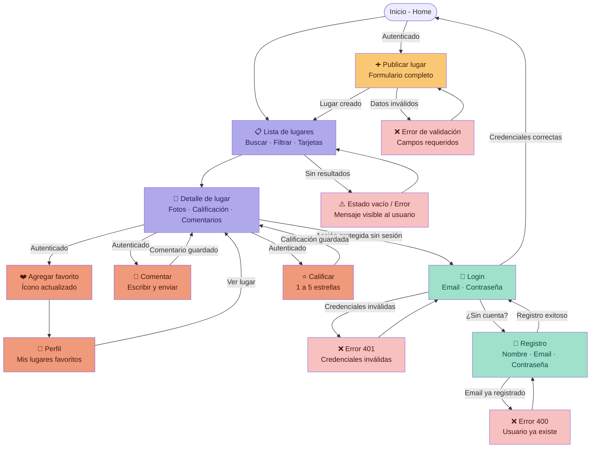

# D02 — Diagrama de flujo de usuario (navegación entre pantallas)
## Descubre Medellín

Muestra cómo el usuario navega entre las pantallas del sistema, incluyendo estados de error y flujos autenticados.

### Descripción de pantallas

| Pantalla | Acceso | Descripción |
|----------|--------|-------------|
| Inicio (Home) | Público | Página principal con acceso a las funciones del sistema |
| Lista de lugares | Público | Muestra tarjetas de lugares con búsqueda y filtros |
| Detalle de lugar | Público | Información completa, comentarios y calificación del lugar |
| Login | No autenticado | Formulario de inicio de sesión |
| Registro | No autenticado | Formulario de creación de cuenta |
| Publicar lugar | Autenticado | Formulario para registrar un nuevo lugar |
| Perfil / Favoritos | Autenticado | Vista de lugares guardados por el usuario |
| Estado vacío / Error | Automático | Pantalla informativa ante errores o ausencia de datos |

### Flujos principales

1. **Exploración pública:** Home → Lista de lugares → Detalle de lugar
2. **Autenticación:** Lista de lugares → Login → Home (sesión activa)
3. **Publicar:** Home → Publicar lugar → Lista de lugares
4. **Interacción autenticada:** Detalle → Comentar / Calificar / Agregar a favoritos
5. **Gestión de favoritos:** Favoritos → Detalle de lugar