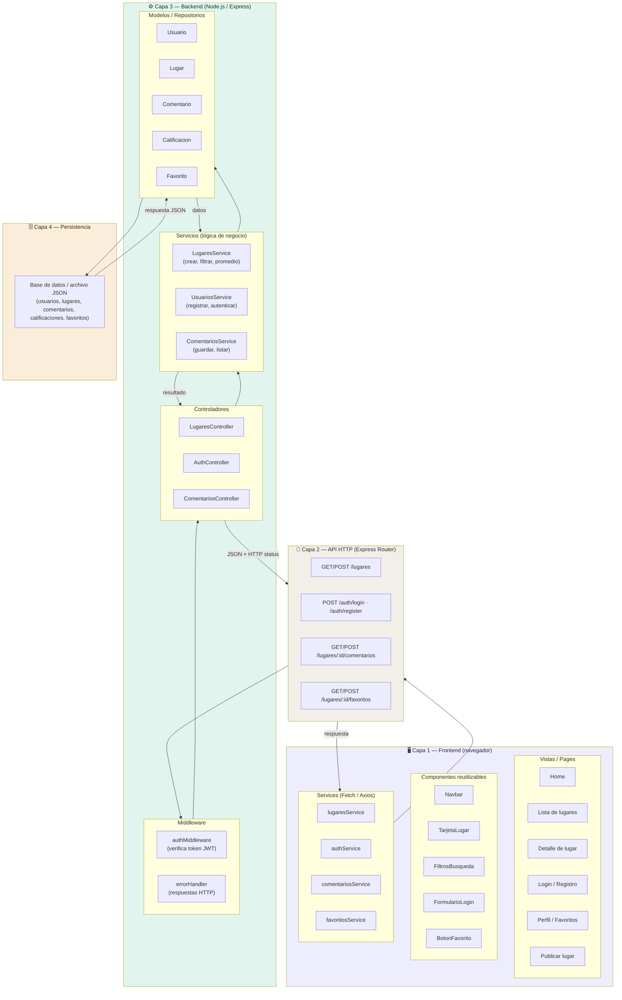

# D05 — Diagrama de componentes y capas
## Descubre Medellín

Explica cómo está organizado internamente el software, mostrando las capas del sistema, sus módulos y las relaciones entre ellos.



### Descripción de cada capa

#### Capa 1 — Frontend
Interfaz que el usuario ve y con la que interactúa en el navegador. Se divide en tres subcapas:

| Subcapa | Responsabilidad |
|---------|----------------|
| Vistas (Pages) | Pantallas completas del sistema. Componen los componentes y usan los servicios para obtener datos. |
| Componentes | Piezas de UI reutilizables. Reciben datos por props y emiten eventos. No hacen llamadas a la API directamente. |
| Services | Única capa del frontend que se comunica con el backend. Encapsula todas las llamadas HTTP (Fetch o Axios). |

#### Capa 2 — API HTTP
Capa de comunicación que expone los endpoints del sistema. Recibe las peticiones del navegador, aplica el middleware correspondiente y las delega al controlador adecuado. Responde siempre en formato JSON.

#### Capa 3 — Backend

| Subcapa | Responsabilidad |
|---------|----------------|
| Middleware | Intercepta peticiones antes de llegar al controlador. Verifica autenticación (JWT) y centraliza el manejo de errores. |
| Controladores | Punto de entrada HTTP. Coordinan el flujo: reciben la petición, invocan el servicio y retornan la respuesta con el código HTTP correcto. |
| Servicios | Contienen la lógica de negocio: validar reglas del dominio, calcular el promedio de calificaciones, verificar duplicados en favoritos, gestionar contraseñas. |
| Modelos | Representan las entidades del dominio y encapsulan el acceso a datos: leer, escribir, actualizar y relacionar registros. |

#### Capa 4 — Persistencia
Almacena toda la información del sistema. Puede ser un archivo JSON administrado por el backend o una base de datos relacional/no relacional. En ningún caso el frontend accede directamente a esta capa.

### Principio de separación de responsabilidades

```
Usuario
  → Vista (qué ve)
    → Componente (cómo se muestra)
      → Service frontend (cómo se pide)
        → API HTTP (cómo se enruta)
          → Middleware (quién puede pasar)
            → Controlador (qué se hace)
              → Servicio backend (cómo se procesa)
                → Modelo (dónde se guarda)
                  → Base de datos
```

Cada capa solo conoce a la capa inmediatamente inferior. El frontend no conoce la base de datos; los modelos no conocen HTTP.